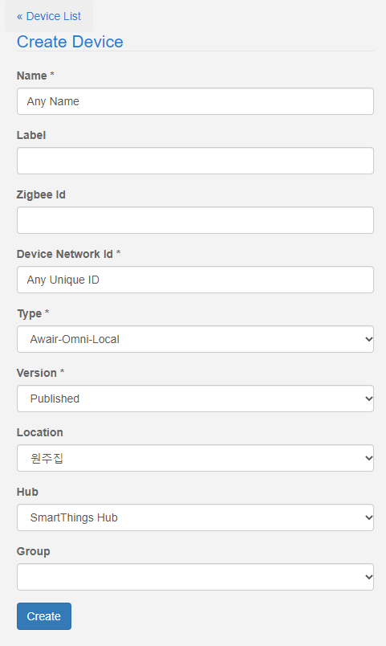
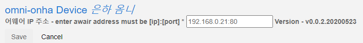

# Smartthings Awair Local
Smartthings <-> (LocalLAN) <-> Awair

* Feature
  * must need smartthings hub
  * update value via local network
  * polling every 1min

* example
  * go to smartthings ide [smartthings ide](https://graph.api.smartthings.com/)
  * My Locations -> Select Location
  * Install DTH (Only Device Handler needed)
    * [FAQ: An Overview of Using Custom Code in SmartThings](https://community.smartthings.com/t/faq-an-overview-of-using-custom-code-in-smartthings-smartthings-classic/16772)
  * Install Device
    * My Devices -> New Device
    * Add new Device
    * 
  * My Devices -> Your Awair Device
    * setup preference
    * must specify port
    * 
  * Live logging
    * check data is update fine.